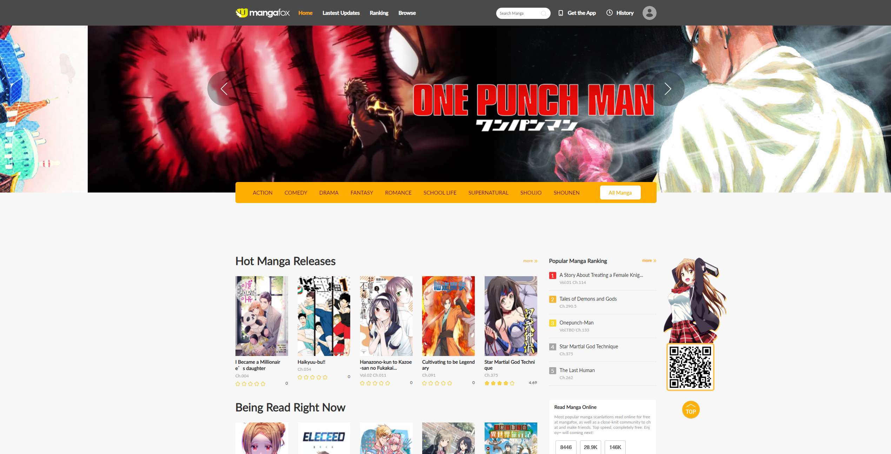
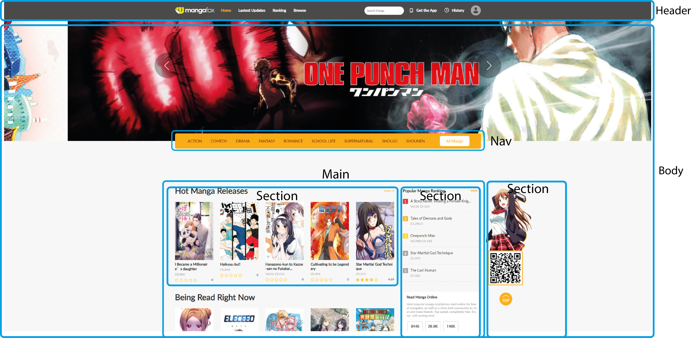
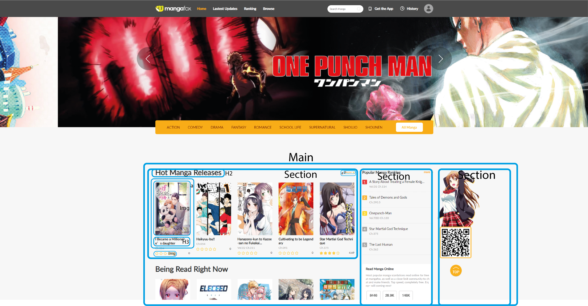
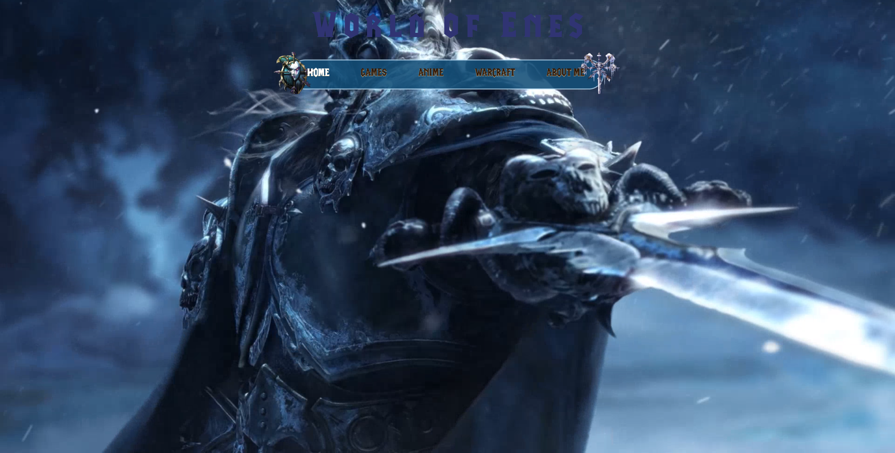
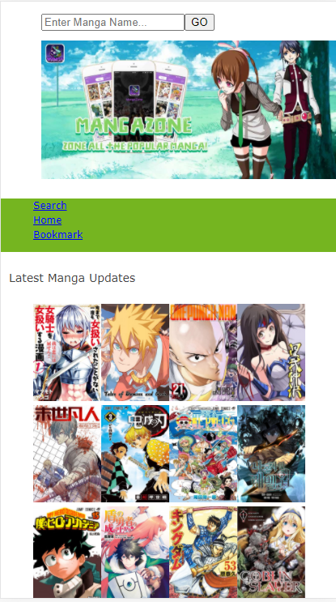
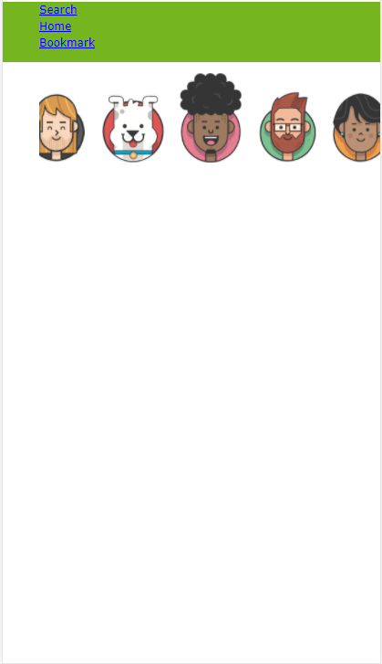

# Procesverslag
**Auteur:** Enes Demir

Markdown cheat cheet: [Hulp bij het schrijven van Markdown](https://github.com/adam-p/markdown-here/wiki/Markdown-Cheatsheet). Nb. de standaardstructuur en de spartaanse opmaak zijn helemaal prima. Het gaat om de inhoud van je procesverslag. Besteedt de tijd voor pracht en praal aan je website.

## Intake (week 1)

**Startniveau:** Mijn start niveau is zeker weten de **Rode piste**. Ik heb in het verleden veel gecodeerd en vind het ook zeer leuk, alleen duurd het alleen een tijdje voordat ik de juiste motivatie, tijd en onderliggende vaardigheden naar boven komt.

**Focus:** De focus zal gelegd worden op *helemaal responsive* formaat. Ik vind het interest om de site te verwerken in een zo een formaat en daar zal ik dan ook op focusses aangezien ik all ideeën heb hiervoor. 

**Opdracht:** De site waar ik mee zal werken heet [fanfox](http://fanfox.net/), maar staat meer bekend als **Mangafox** zoals je kan zien op de banner van de site. De ervaring is veel te simpel en ik ben van mening dat het beter kan worden.

**Reden:** Ik ben een hopelose mangafan en ben van mening dat de ervaringen online niet altijd even leuk is als een fysieke kopie in de hand, dus ben ik van mening dat ik hier net water beter ervaringen van kan maken met de code vaardigheden die ik momenteel heb. Natuurlijk is er ook een flexibile reden aan gebonden, indien het op de gekozen formaat niet lukt kan ik overschakelen naar de andere. De manier hoe ik het ga aanpakken zit ook veel uitdagingen in omdat ik het meer interactief wil maken, en dat is hevig gebonden aan mijn javascript en google skills.

**Screenshot(s):**

**Breakdown-schets(en):**

## Voortgang 1 (week 3)

### Stand van zaken

Ik probeerde de experimenteren om over te schakelen naar een Zwarte Piste. Mijn site die ik hiervoor mee begonnen was had een interessante en misschien wat persoonlijk concept. De bedoeling was dat ik mijn eigen "home site" kon creeren gebaseerd om mijn persoonlijke interreses en hobbies, waarin er meerder functies dat er tot mijn beschikking was. Als een programmeur voor mijn vorige opleiding heb ik nog wel wat ervaring en kennis op het gebied van PHP en MySql. Helaas vond ik dit een beetje te ambitious en was voortgang te langzaam om dit voort te zetten. Ik had zelfs digitale assets op illustrator gemaakt. Als gevolg ben ik weer overgeschakeld naar Rode Piste.

-dit ging goed & dit was lastig-

In mijn Rode piste opdracht had ik dan ook een stuk meer succes op het gebied van coderen omdat het wat simpeleren en doelgericht was. Ik hoefde geen nieuwe functies en ideeen te bedenken in hierop constant intern iteraties te maken. Mijn rode piste opdracht is gebaseerd op "Mangafox" site waarin je online manga's kan lezen. Ik geloof dat ik hier wel de algemene design en structuur goed heb opgebouwd. 

**Screenshot(s):**

Foto: Site van Zwarte Piste(gefaald)

Feedback Gesprek: 
Ik had een aantal problemen met mijn <ul> elementen die wat naar rechts gaan zonder enige vorm van code die het toegewezen werd. We probeerde het te fixen tijdens het gesprek maar helaas konden we niet op een oplossing uitkomen. Dit lijkt me een vraag voor het voortgang's gesprek. Vervolgens hadden we elkaar nog kleine feedback gegeven voor het verbeteren van onze producten. 
  
Foto: Site van Rode Piste Voortgang

### Agenda voor meeting

-samen met je groepje opstellen-

### Verslag van meeting

-na afloop snel uitkomsten vastleggen-

## Voortgang 2 (week 5)

Ik ben vooral verder gegaan met de details op de hoofdpagina terwijl ik de basis elementen heb toegevoegd op mijn tweede login pagina. Dit was een stuk lastiger dan verwacht aangezien ik veel met containers in containers moet werken. Dit is me uiteindelijk welke netjes gelukt en in samenstelling met flexbox. Mijn doel voor de komende week is dus de paginas compleet af te maken en vervolgens animatie toe te voegen en mogelijk meer content toevoegen zodat het een stuk meer complex is. 

## Voortgang 3 (week 6)

-same as voortgang 1-

## Eindgesprek (week 7/8)

-dit ging goed & dit was lastig-

**Screenshot(s):**

-screenshot(s) van je eindresultaat-

## Bronnenlijst
1. -bron 1-
2. -bron 2-
3. -...-
